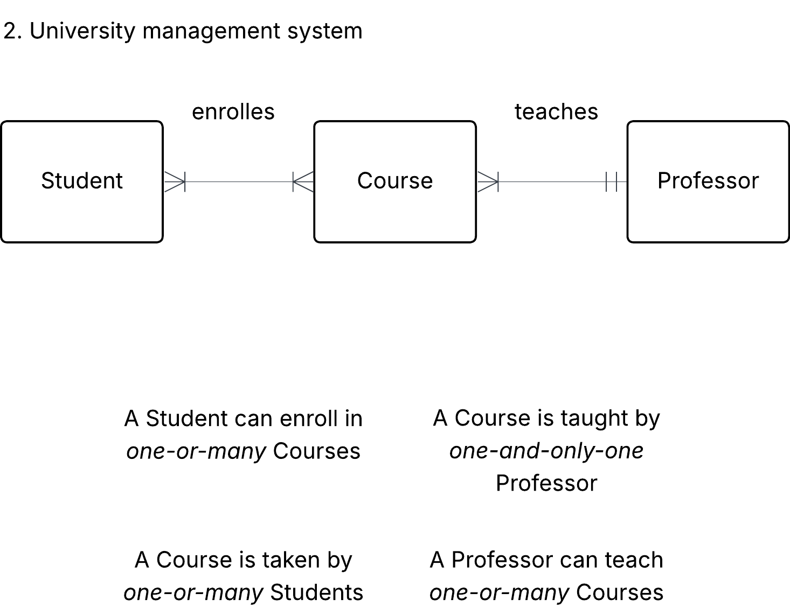

# Exersice 0

PK = Primary Key

FK = Foreign Key

## 0. Library Bookly

### A) Intities and attributes

**Book** (_ISB-number(PK), author_id(FK), title_)

**Member** (_membership_id(PK),ISB-number(FK) first_name, last_name_)

**Author** (_author_id(PK), first_name, last_name_)

**Contact_information** (member*id(FK), phone_nr, email*)

### B) Determine the relationship between member and books.

- A member can borrow _one or many_ books
- A book can be borrowed by _one and only one_ customer
- A member contains _one and only one_ contact information
- Contact information belongs to _one and only one_ member

### c) Draw a conceptual ERD using crow foots notation

## 1. Conceptual ERD to words

This is an ERD conceptual diagram that a database designer and the business stakeholders agreed upon in a car rental company called Carent.

### A) Describe the entities in this conceptual ERD.

**Customer** (customer_id(PK), first_name, last_name, rent_id(FK), phone_nr, card_nr)

- _customer_id_ - PK and has an unique value for each customer
- _fist_name_ - first name of the customer
- _last_name_ - last name of the customer
- _phone_nr_ - phone number is the required contact information for the customer
- _card_nr_ - card number is the payment info from the customer

**Rental** (rent_id(PK), licence_plate(FK), rental_period)

- _rent_id_ - PK and unique
- _licence_plate_ - FK and unique for the car
- _rental_period_ - rental period counted in days

**Car** (licence_plate(PK), model, fuel_type,transmission, price_per_day)

- _licence_plate_ - PK and uniqe for each car
- _model_ - the model of the car
- _fuel_type_ -energy source (Gasoline, Diesel, Electric, Hybrid)
- _transmission_ - type of gearbox (Manual, Automatic)
- _price_per_day_ - cost to rent the car per day

### B) Write out the relationship labels.

**Customer** -- _books_ -- **Rental** -- _uses_ -- **Car**

### C) Describe the relationships between the entities (one-to-many, one-to-one and many-to-many).

Customer -- _one-or-many_ -- Rental

Rental -- _one-and-only one_ -- Customer

Rental -- _one-or-many_ -- Cars

Car -- _one-and-only one_ -- Rental

### D) Define the relationship statement for example: "A Customer can have one or more Rentals".

- A Customer can book one or many Rentals
- A Rental can have exactly one Customer
- A Rental can include one or many Cars
- A Car can just be included in one Rental

## 2. University management system

A university needs a system to manage students, courses, and professors.

- each student can enroll in multiple courses.
- each course is taught by one professor.
- a teacher can teach multiple courses.

### A) Identify entities and their relationships

**Student** -- _enrolles_ -- **Course** -- _teaches_ -- **Professor**

- A Student can enroll in _one-or-many_ Courses
- A Course is taken by _one-or-many_ Students
- A Course is taught by _one-and-only-one_ Professor
- A Professor can teach _one-or-many_ Courses

### B) Come up with possible attributes for the entities

**Student** (student_id (PK), course_id(FK), first_name, last_name, email)

- student_id - PK unique value
- course_id - FK from Course table and unique
- first_name - first name of student
- last_name - last name of student
- email - email adress to student

**Course** (course_id(PK), teacher_id(FK), course_name, course_points)

- course_id - PK for the course and unique value
- teacher_id - FK from Teacher table and unique
- course_name - the name of the course
- course_points - the points for the course (15hp, 30hp etc.)

**Professor** (teacher_id(PK), first_name, last_name, email)

- teacher_id - PK and unique for the professor
- first_name - first name of the professor
- last_name - last name of the professor
- email - email adress to the professor

### C) Draw conceptual ERD with cardinalities

### D) Define business rules (e.g. a student can enroll in max 4 courses)

- The student can read maximum 45hp per semester
- required to add an attribute for _total_course_points_ for the Student
- all primary and FKs are Unique values
- the email in Student and Professor must contain an @

## 3. Onshop

- An e-commerce platform Onshop manages customers, orders, and products.
- a customer can place multiple orders.
- each order contains multiple products.
- a product can belong to multiple categories.

### A) Identify key entities and their attributes (e.g., customer_name, order_date)

**Customer** (customer_id(PK), order_nr(FK) first_name, last_name, email)

- Customer **places** _one or many_ orders
- Order **contains** _one and only one_ Customer

**Order** (order_nr(PK), product_id(FK))

- Order **contains** _one or many_ Product
- Product **belongs** to _one or many_ Orders

**Product** (product_id(PK), product_name, price, category_id(FK))

- Product **belongs** to _one or many_ Orders
- Category **contains** _one or many_ Products

**Category** (category_id(PK), category_name)

- Category **contains** _one or many_ Products
- Product **contains** _one and only one_ Category

### B) Sketch the conceptual ERD.

### C) Define business rules

- the Customer email must contain an @
- all of the Primary and Foreign Keys are unique
- A product can just belong in one category
- Order can contain more than one product_id (and products)
